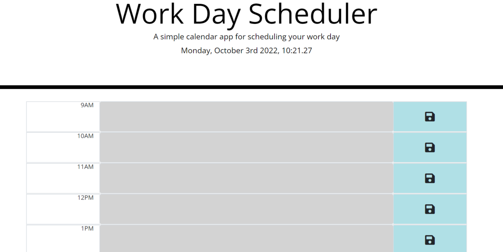

# 05-Third-Party-APIs-Work-Day-Scheduler
 
## Link to deployed application
 https://calvindt.github.io/Module-05-Third-Party-API-Work-Day-Scheduler/

## Description 

This application uses jquery, bootstrap, and moment.js to allow you to plan out your work day. You can write out your schedule for each hour and the app will help you keep track of time by coloring each hour with colors for past, present, and future.

## Usage 

Simply click on the text area of the timeblock you want to alter and type in your schedule for the hour. When you are done, click the save icon and everything you typed for the timeblock will be saved in local storage for later use.

## Technology Used

* HTML
* CSS
* JavaScript
* Bootstrap
* jQuery
* moment.js

## Screenshots

## GIF

## Contact

### email

Calvin Turner <ct223344@gmail.com>

Copyright (c) [2021] [Calvin Turner]
